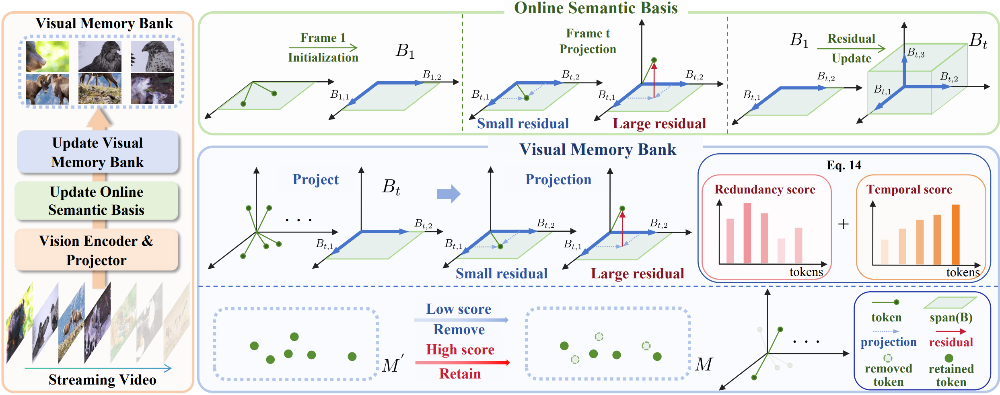

# Towards a Dynamic and Fixed-budget Memory Bank for Efficient Streaming Video Understanding

CausalMem is a **training-free dynamic visual memory framework** designed for efficient streaming video understanding with Multimodal Large Language Models (MLLMs). Unlike conventional compression methods that rely on static token pruning or full-context processing, CausalMem maintains a **fixed-budget memory bank** that is continuously updated as video frames arrive. By estimating visual token redundancy with an online semantic basis, CausalMem preserves the most informative semantics of the observed video stream, enabling long-duration video understanding with high compression efficiency and strong performance under both streaming and offline settings.

<p align="center">
  <a href="img/overall_v2.png">
    
  </a>
</p>

### Highlights
* 🚀 **Training-Free**: No additional model training or fine-tuning required.
* 🧠 **Dynamic Memory Bank**: Continuously updates a fixed-budget visual memory for streaming video understanding.
* 🎯 **Semantic Preservation**: Estimates token redundancy via an online semantic basis to retain informative visual tokens.
* ⚡ **Highly Efficient**: Memorizes hour-long streaming videos with only **12k visual tokens**, achieving over **20× token compression**.
* 📈 **Effective**: Achieves consistent gains on both streaming and offline video benchmarks, with **+3.2%** and **+3.0%** average accuracy improvements.
* 🔧 **Plug-and-Play**: Easily applicable to representative MLLMs such as **LLaVA-OneVision** and **Qwen2.5-VL**.

### conda environment set up
```
conda create -n causalmem python==3.10.0
conda activate causalmem
cd LLaVA-NeXT-main/
pip install -e .
pip install torch==2.2.1 torchvision==0.17.1 torchaudio==2.2.1 \
--index-url https://download.pytorch.org/whl/cu121
pip install transformers==4.45.1 decord einops accelerate==0.26.0 numpy==1.26.1
## flash-attention
pip install ninja packaging
pip install flash-attn==2.5.8 --no-build-isolation
```


