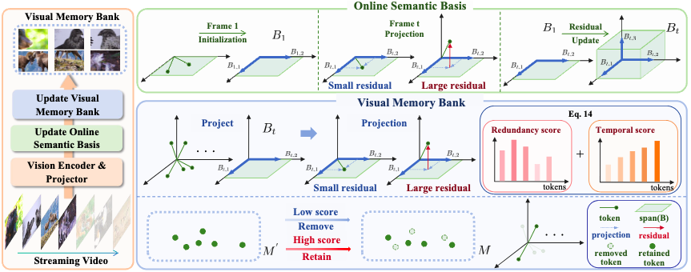

# Code of CausalMem
<p align="center">
  <a href="img/overall.png">
    
  </a>
</p>
## conda environment set up
```
conda create -n causalmem python==3.10.0
conda activate causalmem
cd LLaVA-NeXT-main/
pip install -e .
pip install torch==2.2.1 torchvision==0.17.1 torchaudio==2.2.1 \
--index-url https://download.pytorch.org/whl/cu121
pip install transformers==4.45.1 decord einops accelerate==0.26.0 numpy==1.26.1
## flash-attention
pip install ninja packaging
pip install flash-attn==2.5.8 --no-build-isolation
```
